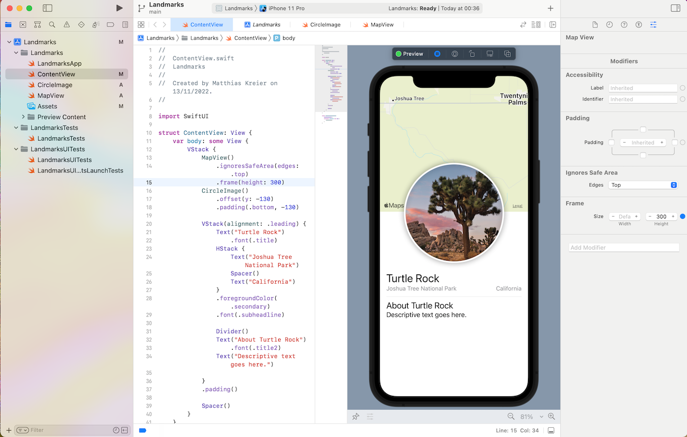

# SwiftUI_Landmarks

Following the tutorial on SwiftUI

There are 2 tutorials to build the Landmark App in SwiftUI:

- [Creating and Combining Views](https://developer.apple.com/tutorials/swiftui/creating-and-combining-views)
- [Building Lists and Navigation](https://developer.apple.com/tutorials/swiftui/building-lists-and-navigation)

The final product after an hour is a good looking program.

## Creating and Combining Views

The result looks like this:

## Building Lists and Navigation

The result looks like this:

